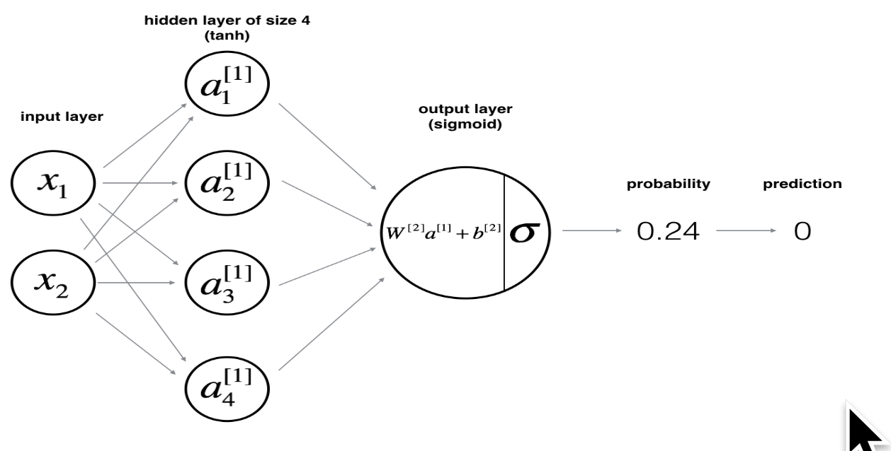

```{r setup, include=FALSE}
knitr::opts_chunk$set(echo = TRUE)
library(tidyverse)

sigmoid <- function(x) 1 / (1 + exp(-x))
broadcast <- function(b){
   reduce(rerun(ncol(X), b), cbind)
}
```

# Summary

X: features * observations  
W1: neurons in layer i * feature-weights  
bi: neurons in layer i * 1 (need broadcasting)  
Z1 = Wi * X + bi: neurons in layer i * observations  
A1 = activation_function(Zi): neurons in layer i * observations  

Wi — (neurons in layer i * neurons in layer i - 1 )   
x  
X or Ai — (neurons in layer i - 1 * observations)  
=  
Zi — (neurons in layer i * observations)  

# Implement example

Let's implement a 2 x 4 x 1 NN: 



What each of the activation functions looks like:

```{r}
tibble(x = seq(-4, 4, 0.01)) %>% 
   mutate(
      tanh = tanh(x),
      sigmoid = sigmoid(x)
   ) %>%
   gather(var, y, -x) %>% 
   ggplot(aes(x, y, color = var)) +
   geom_point()
```

## Hidden layer

X is our input matrix. Each column is one of our 5 observations. The row is a feature.

```{r}
(X <- matrix(c(1, 2), nrow = 2, ncol = 5))
```

4 neurons in the 1st layer. Dimensions of are to * from which is 4 * 2. This is to * from.

```{r}
(W1 <- matrix(c(1, 2), nrow = 4, ncol = 2, byrow = TRUE))
```

We also have b which is like the intercept of that layer. Its dimensions are to * 1

```{r}
(b1 <- matrix(1, nrow = 4, ncol = 1))
```

Now this is where we are after the first hidden layer

```{r}
(Z1 <- W1 %*% X + broadcast(b1))
```

We apply the activation function to Z.

```{r}
(A1 <- tanh(Z1))
```

## Output layer

Must have 1 layer so we have a singular prediction.

```{r}
(W2 <- matrix(1, nrow = 1, ncol = 4, byrow = TRUE))

(b2 <- matrix(-0.5, nrow = 1, ncol = 1))

(Z2 <- (W2 %*% A1 + broadcast(b2)))

(A2 <- sigmoid(Z2))
```

